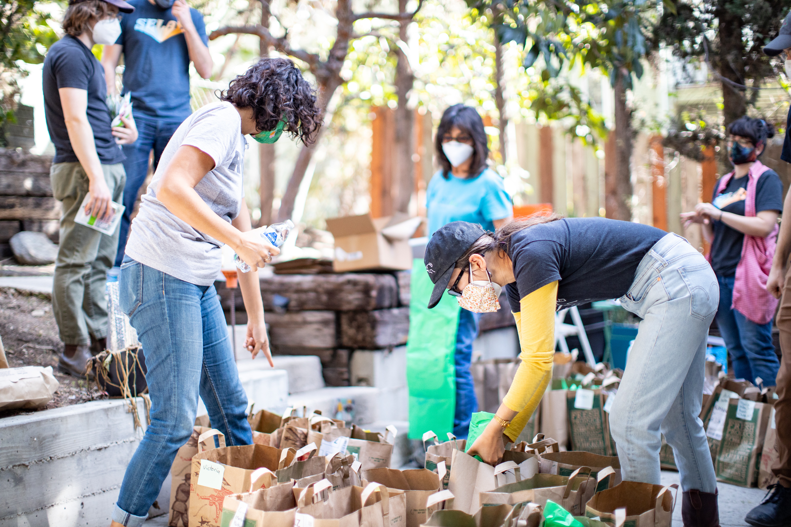
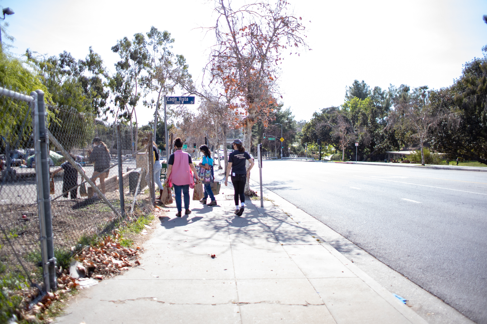
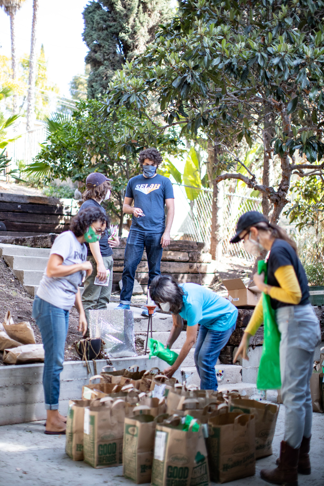

	

		
NENO has worked since 2019 to support unhoused people in Northeast&nbsp;LA.

		<h1 class="display-5 fw-bold">Learn more about who we&nbsp;are.</h1>
	





	

		<h3 class="text-secondary mx-auto mb-4 fw-bold">Northeast Neighborhood Outreach (NENO) is a volunteer-led and volunteer-run organization that supports our unhoused neighbors in northeast Los Angeles.</h3>

		
 We deliver this support through weekly outreach, connection to services, and policy advocacy. Our goal is to improve the lives of those who are currently unhoused in northeast LA, and to do what we can to help end the housing&nbsp;crisis. 

	

	

		

			<h3 class="text-dark my-4 text-bold mx-auto">Our story</h3>

			
 Before we were NENO, we were the Eagle Rock-Highland Park chapter of SELAH Neighborhood Homeless Coalition, established in 2019.

			

			With SELAH’s support, our diverse team acquired experience, built trust through consistent presence in the community, and engaged in neighborhood councils and policy discussions. As we set our own course, we will also use our own voice on issues that shape life for the unhoused in our city. 

		

		

			
		

	

	

		

			
		

		

			<h3 class="text-secondary my-4 text-bold mx-auto">What we do</h3>

			
 Each Sunday, NENO volunteers visit dozens of community members experiencing homelessness—exceeding 100 at the peak of the local crisis—where they live. We build trust by supplying basic needs like food, water, clothing, tents, blankets, phone chargers, hygiene kits, and harm reduction supplies. Once trust exists, we support them on their path to housing, whatever that looks like.

			

			Behind that program are NENO’s dedicated bagging volunteers and the gracious support of Highland Park Brewery, the generous sponsor of our food distribution program and a great place to grab a pint, we think. 

		

		

			
		

	

	

		

			<h3 class="text-dark my-4 text-bold mx-auto">How we work</h3>

			
 NENO is a "member nonprofit," meaning our board and officers are elected annualy by our members, and important decisions about our organization are made by members in our general meetings. We're a 501(c)(3) nonprofit organization, which allows donations to our organization to be tax-deductible.

			
If you are interested in joining NENO, check out our open volunteering opportunities below; we are always looking for passionate new members who want to partner with us to improve life for unhoused people in our neighborhood.

			

	         	<a href="join" role="button" class="btn btn-primary rounded-pill">Join us!</a>
	        

		

		

			
		

	

