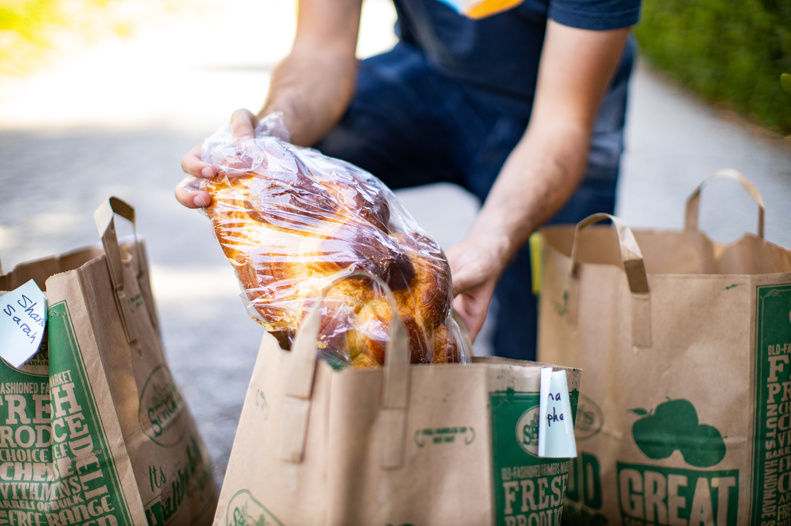
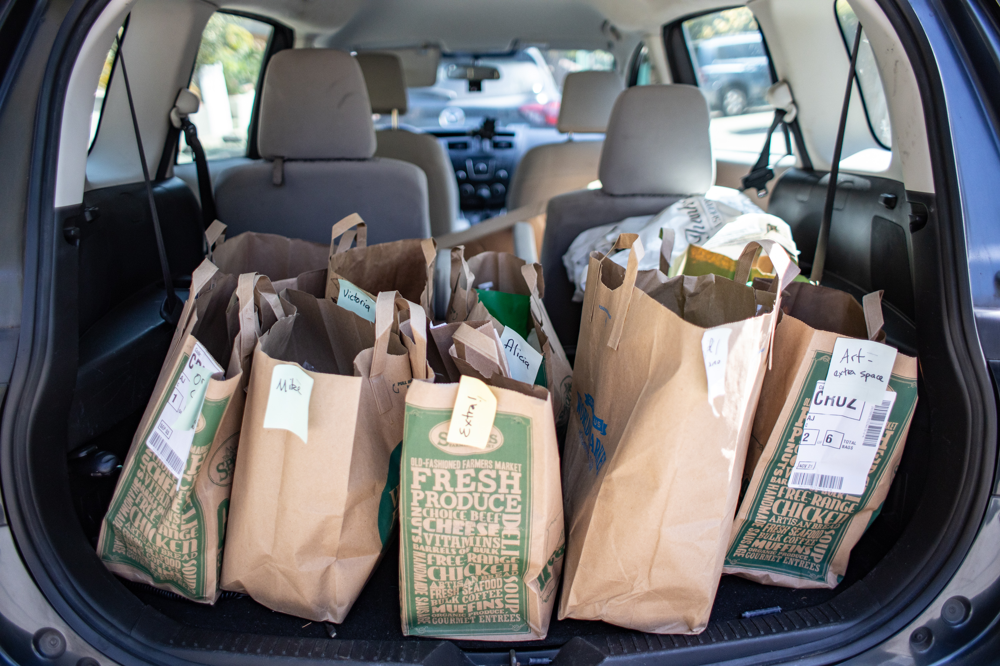

	

		<h1 class="text-dark display-6 my-4 mx-auto text-bold text-center">Donate to support NENO!</h1>
		
 NENO's work would be impossible without the kindness and support of our donors. We are a 501(c)(3) nonprofit organization, meaning all donations are tax-deductible.

		
 Since we are a completely volunteer organization, all funds go directly to funding our operating costs like supplies for our unhoused neighbors. Any donations are very much appreciated!

		

			

				
			

			

				
			

		

	

	

		<iframe src="https://donorbox.org/embed/northeast-neighborhood-outreach" name="donorbox" allowpaymentrequest="allowpaymentrequest" seamless="seamless" frameborder="0" scrolling="no" height="900px" width="100%" style="max-width: 500px; min-width: 250px; max-height:none!important"></iframe>
	

