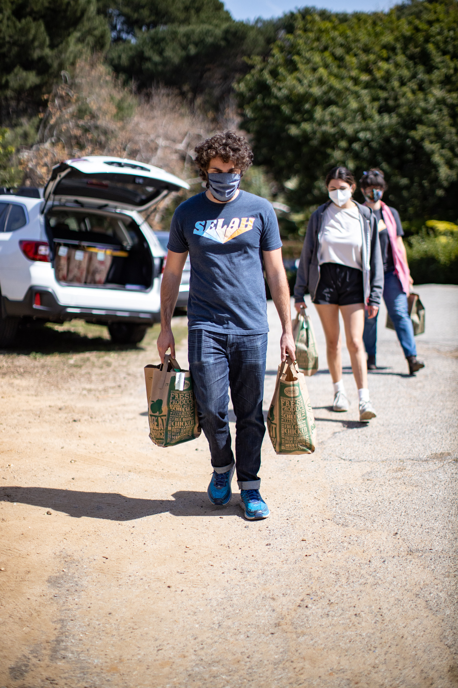
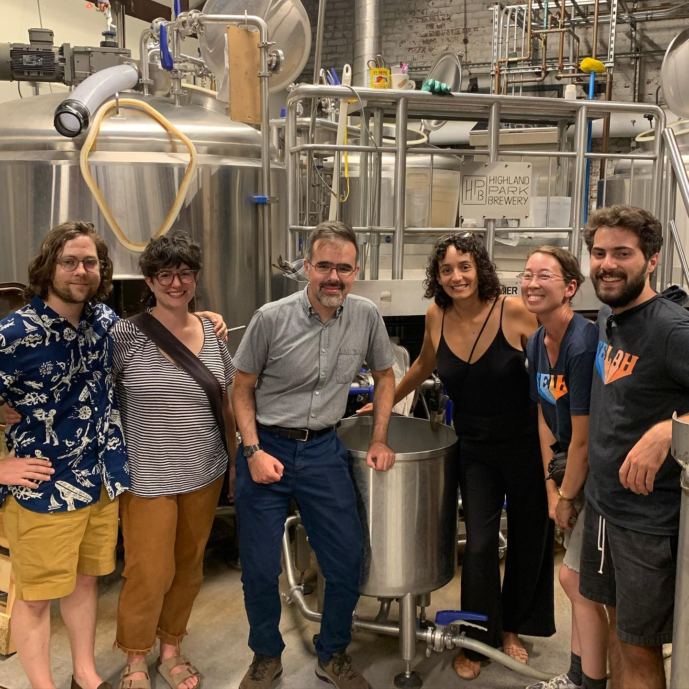
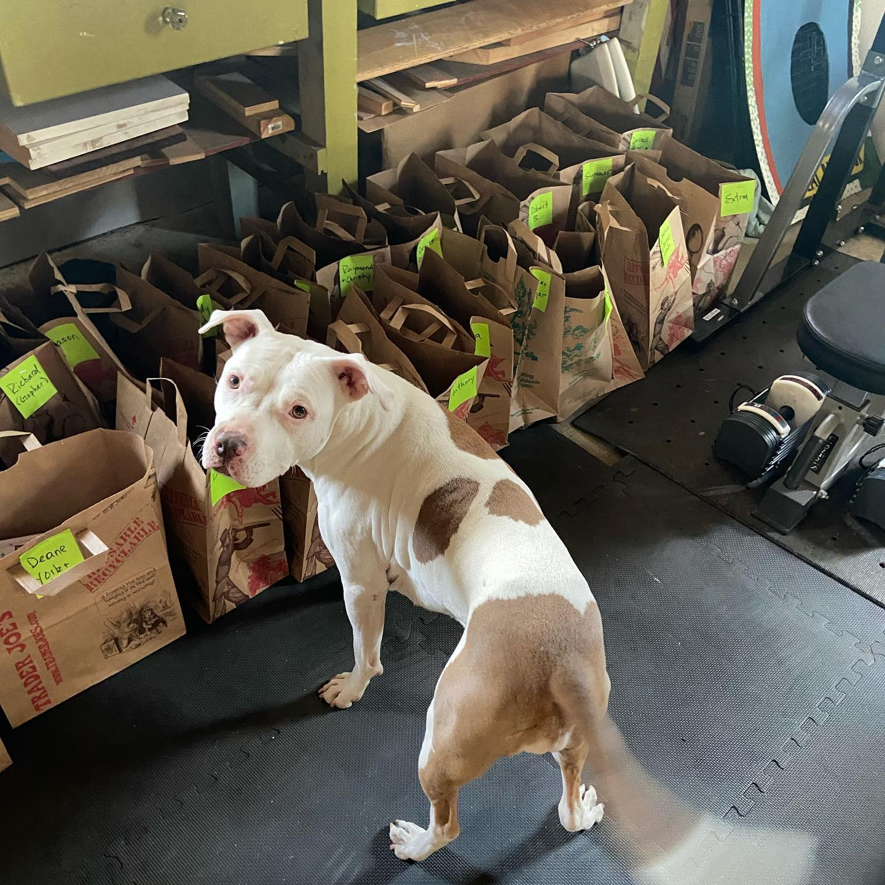

	

		
NENO is a 100% volunteer-run organization that relies on donors to fund our work.

		<h1 class="display-5 fw-bold mb-0">Here's how you can get involved.</h1>
	






	



	<h3 class="col-10 my-2 mx-auto {{heading-color}} text-md-center fw-bold">Volunteer with us!</h3>

	
We are currently seeking new volunteers to help us grow our organization.

	{{hrule}}
	

		

			<h4 class="{{heading-color}} my-4 fw-bold mx-auto">Outreach (Eagle Rock or Highland Park)</h4>
			
<b>What:</b> Visit our unhoused neighbors to build relationships with them, check in about any services they might need, and distribute supplies such as groceries, tents, and hygiene kits. <em>Volunteers que pueden hablar español encouraged!</em>

			
<b>When:</b> Sundays, 10:30am-1pm.

			

	         	<a href="mailto:info@neno-la.org" role="button" class="btn btn-primary rounded-pill">Contact Us to Sign Up</a>
	        

		

		

			
		

	

	{{hrule}}

	

		

			<h4 class="{{heading-color}} my-4 fw-bold mx-auto">Bagging</h4>
			
<b>What:</b> Help us prepare for weekly outreach by building grocery bags for each neighbor on our route, gathering any additional supplies they might need.

			
<b>When:</b> Saturdays, 9:30-10:30am.

			

	         	<a href="mailto:info@neno-la.org" role="button" class="btn btn-primary rounded-pill">Contact Us to Sign Up</a>
	        

		

		

			
		

	

	{{hrule}}
	

		

			<h4 class="{{heading-color}} my-4 fw-bold mx-auto">Social Media and Fundraising</h4>
			
 We also are seeking a social media coordinator and general help with fundraising! Please email <a href="mailto:info@neno-la.org">info@neno-la.org</a> if you are interested. 

		

		

			
		

	



	

		

			<h3 class="my-4 mx-auto {{heading-color}} text-bold">Donate</h3>

			
NENO depends on in-kind donations from the community to fund our operations. While we are a 100% volunteer organization, we use our funds to purchase supplies to distribute to our unhoused neighbors, including blankets, tents, hygeine kits, and clothing. 

			
NENO is a 501(c)(3) non-profit organization, and all donations are tax-deductible. Please consider making a recurrent donation to help fund us on a consistent basis. Your support is appreciated!

			

	         	<a href="donate" role="button" class="btn btn-primary text-light btn-lg rounded-pill">Donate</a>
	        

       	

       	

			
		

   	



	

		

			<h3 class="{{heading-color}} my-4 mx-auto text-bold">Stay up-to-date on NENO's events and current work!</h3>

			
Join our mailing list to stay connected with us and get regular updates.

			

		

		

		

			<form method="POST" action="https://api.sheetmonkey.io/form/saj4XFEdD4XTXiU9fCxGuC" id="contact-form">
		  		

		    		<input type="name" class="form-control" name="Name" aria-describedby="nameHelp" placeholder="Full name">
		  		

		  		

		    		<input type="email" class="form-control" name="Email" aria-describedby="emailHelp" placeholder="Email">
		  		

		  		<button type="submit" class="d-grid btn btn-primary mx-auto my-2">Sign up</button>
			</form>
		

	

